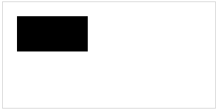

# Rectangle

## Introduction

The rectangle is one of the most fundamental shapes in the **CanvasPainter** library. It can be drawn in different ways depending on the use case, such as using the top-left corner as a reference point or using the center. This chapter will guide you through setting up and drawing rectangles using **CanvasPainter**, showcasing different configurations and illustrating the rendered output.

## Draw a basic Rectangle

The simplest use case is drawing a rectangle by specifying the `x`, `y`, `widt` and `height`. By default `x` and `y` specify the top-left corner of the rectangle.

### Example Code:

```typescript
import { Canvas, Rectangle } from 'canvas-painter';

const canvas = Canvas.init('myCanvas');

const rectangle = new Rectangle(10, 10, 50, 30); // x, y, width, height

// Draw the rectangle on the canvas
canvas.draw(rectangle);
```

### Rendered Output:
