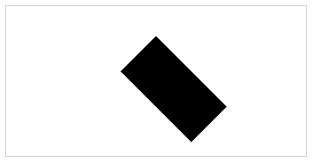

- [Usage](#usage)
- [Draw a basic rectangle](#draw-a-basic-rectangle)
  - [Example code:](#example-code)
  - [Rendered Output:](#rendered-output)
- [Draw a centered rectangle](#draw-a-centered-rectangle)
  - [Example Code:](#example-code-1)
  - [Rendered Output:](#rendered-output-1)
- [Draw a rotated rectangle](#draw-a-rotated-rectangle)
  - [Example Code:](#example-code-2)
  - [Rendered Output:](#rendered-output-2)
- [Modify a rectangle](#modify-a-rectangle)
  - [Example Code:](#example-code-3)
  - [Available properties](#available-properties)
  - [Available methods](#available-methods)
- [Get properties of a rectangle](#get-properties-of-a-rectangle)
  - [Example Code:](#example-code-4)
  - [Available properties](#available-properties-1)
- [Styles for rectangle](#styles-for-rectangle)
- [Options for rectangle](#options-for-rectangle)

<!-- toc-end -->

The rectangle is one of the most fundamental shapes in the **CanvasPainter** library. It can be drawn in different ways depending on the use case, such as using the top-left corner as a reference point or using the center. This chapter will guide you through setting up and drawing rectangles using **CanvasPainter**, showcasing different configurations and illustrating the rendered output.

## Usage

A new rectangle shape is created using the `Rectangle` constructor.

```typescript
import { Rectangle } from 'canvas-painter';

const rectangle = new Rectangle(
  x,        // The x-coordinate of the rectangle's position.
  y,        // The y-coordinate of the rectangle's position.
  width,    // The width of the rectangle.
  height,   // The height of the rectangle.
  rotation, // (optional) The initial rotation of the rectangle in degrees clockwise.
  style,    // (optional) Style properties for this rectangle.
  options   // (optional) Options for this rectangle.
);
```

The detailed API documentation for `Rectangle` can be found here: https://avolutions.github.io/canvas-painter/api/classes/Rectangle.html

## Draw a basic rectangle

The simplest use case is drawing a rectangle by specifying the `x`, `y`, `width` and `height`. By default `x` and `y` specify the top-left corner of the rectangle.

### Example code:

```typescript
import { Canvas, Rectangle } from 'canvas-painter';

const canvas = Canvas.init('myCanvas');

// x, y, width, height
const rectangle = new Rectangle(150, 75, 100, 50)

canvas.draw(rectangle);
```

### Rendered Output:


In this example we draw a rectangle with a size of 100 x 50 pixels where the top-left corner is at x = 150 and y = 75.

## Draw a centered rectangle

In some cases, you might want to center the rectangle on a specific point. The Rectangle class supports this by allowing the center to be passed instead of the top-left corner.

### Example Code:

```typescript
import { Canvas, Rectangle } from 'canvas-painter';

const canvas = Canvas.init('myCanvas');

// x, y, width, height, rotation, style, options
const rectangle = new Rectangle(150, 75, 100, 50, 0, null, { centered: true });

canvas.draw(rectangle);
```

### Rendered Output:


In this example we draw a rectangle with a size of 100 x 50 pixels where the center is at `x` = 150 and `y` = 75 by setting the option `centered`.

## Draw a rotated rectangle

In some cases, you may need to draw rectangles at angles other than the default 0 degrees. This can easily be archived by setting the `rotation` via constructor. The `rotation` is defined as degrees in clockwise direction. To rotate counter clockwise just pass a negative value. If `centered` option is specified the rectangle is rotated around the center and not top-left corner.

### Example Code:

```typescript
import { Canvas, Rectangle } from 'canvas-painter';

const canvas = Canvas.init('myCanvas');

// x, y, width, height, rotation
const rectangle = new Rectangle(150, 30, 100, 50, 45);

canvas.draw(rectangle);
```

### Rendered Output:


In this example, the rectangle is rotated 45 degrees clockwise around its top-left corner.

## Modify a rectangle

In this chapter, you'll learn how to update a rectangle's properties such as its `width`, `height`, `position`, `rotation` and `style` using the setters provided by **CanvasPainter**. Additionally, you'll explore how to use methods like `setSize()`, `resize()`, `move()`, and `rotate()` to dynamically update the rectangle's attributes.

There are two different ways to modify the rectangle definition:
1. Set the properties directly to a new value
2. Using helper methods to modify the properties by a given delta

### Example Code:

```typescript
import { Canvas, Rectangle } from 'canvas-painter';

const canvas = Canvas.init('myCanvas');

// x, y, width, height
const rectangle = new Rectangle(150, 100, 100, 50);

// Properties
rectangle.width = 50; // Set width to 50px
rectangle.height = 25; // Set height to 25px

// Methods
rectangle.setSize(50, 25); // Set width to 50px and height to 25px
```

### Available properties

Property | Description | Example
--- | --- | ---
`width` | Sets the width of the rectangle. | `rectangle.width = 50;`
`height` | Sets the height of the rectangle. | `rectangle.height = 50;`
`position` | Sets the position (x and/or y) of the rectangle. | `rectangle.position = { x: 50, y: 50 };`<br />`rectangle.position.x = 50`
`rotation` | Sets the rotation of the rectangle in degrees clockwise. | `rectangle.rotation = 45;`
`style` | Sets the style attributes of the rectangle. | `rectangle.style = { color: "red" };`<br />`rectangle.style.color = "red";`

### Available methods

Method | Description | Example
--- | --- | ---
`setSize()` | Updates the size of the rectangle by setting new width and height values. | `rectangle.setSize(50, 50);`
`resize()` | Resizes the rectangle by adjusting the current width and height by delta values. | `rectangle.resize(10, -5);`
`move()` | Moves the rectangle by adjusting the current position by delta values. | `rectangle.move(20, -10);`
`rotate()` | Rotates the rectangle by adjusting its current angle. |  `rectangle.rotate(45);`

## Get properties of a rectangle

In addition to manipulating a rectangle's properties, **CanvasPainter** allows you to retrieve the current values of its attributes such as `width`, `height`, `position`, `rotation` and `style`.

### Example Code:

```typescript
import { Canvas, Rectangle } from 'canvas-painter';

const canvas = Canvas.init('myCanvas');

// x, y, width, height
const rectangle = new Rectangle(150, 100, 100, 50);

const width = rectangle.width; // Get current width: 150
```

### Available properties

Property | Description | Example
--- | --- | ---
`width` | Gets the width of the rectangle as number. | `const width = rectangle.width;`
`height` | Gets the height of the rectangle as number. | `const height = rectangle.height;`
`position` | Gets an [Point](https://avolutions.github.io/canvas-painter/api/classes/Point.html) object representing the position of the rectangle. | `const position = rectangle.position;`<br />`const x = position.x;`
`angle` | Gets an [Angle](https://avolutions.github.io/canvas-painter/api/classes/Angle.html) object representing the rotation angle of the rectangle. | `const angle = rectangle.angle;`<br />`const radians = angle.radians;`
`rotation` | Gets the rotation of the rectangle as number indication degrees in clockwise direction. | `const rotation = rectangle.rotation;`
`style` | Gets a [RectangleStyle](https://avolutions.github.io/canvas-painter/api/classes/RectangleStyle.html) object representing the style of the rectangle. | `const rotation = rectangle.rotation;`

## Styles for rectangle

## Options for rectangle
