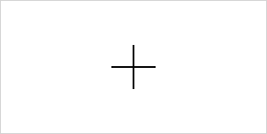
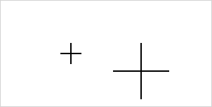

# Create new shapes

**CanvasPainter.js** is designed to be flexible and easy to extend. Besides the built-in shapes like rectangles or circles, you can also create your own custom shapes by extending the `Shape` class. In this example, we will create a simple custom shape called `Cross`.

## Creating a new shape

To define your own shape, you need to extend the `Shape` class and implement the `render` method. The `render` method is where you draw the custom shape using the HTML5 Canvas API. Below is an example of how you can create a `Cross` shape:

```javascript
import { Shape } from '@avolutions/canvas-painter';

class Cross extends Shape {
  render(ctx) {
    ctx.strokeStyle = 'black';
    ctx.lineWidth = 2;

    // Draw vertical line
    ctx.beginPath();
    ctx.moveTo(150, 50);
    ctx.lineTo(150, 100);
    ctx.stroke();

    // Draw horizontal line
    ctx.beginPath();
    ctx.moveTo(125, 75);
    ctx.lineTo(175, 75);
    ctx.stroke();
  }
}
```

In this example:

- We define a `Cross` class that extends `Shape`.
- The `render` method uses the Canvas API (`ctx`) to draw a simple cross consisting of two lines (one vertical and one horizontal).
- The `ctx.strokeStyle` and `ctx.lineWidth` are set to customize the appearance of the lines.

## Render a custom shape

Once you've created your custom shape class, you can easily add it to a canvas instance like any other shape by using either `draw()` or `watch()` method.

```javascript
const canvas = Canvas.init('myCanvas');
const cross = new Cross();

canvas.draw(cross); // or canvas.watch(cross)
```

This will result in the following output:



## Adding dynamic parameters

The initial example of the `Cross` shape is intentionally simple, as it draws the cross at a static position with a fixed size. While this is useful for demonstrating the fundamentals of creating a shape in **CanvasPainter.js**, it lacks flexibility. In many cases, you will want to customize the size, position, and other attributes of the shape dynamically.

To make the `Cross` shape more flexible, we can extend the example by passing parameters such as the position (x, y) and the size to the constructor and using them in the `render` method.

Let’s modify the `Cross` class so that it accepts position and size parameters through the constructor. We’ll then use these values inside the `render` method to draw the cross at the specified position and with the specified size.

Here’s how you can extend the basic `Cross` example:

```javascript
class Cross extends Shape {
  constructor(x, y, size) {
    super();
    this.x = x;
    this.y = y;
    this.size = size;
  }

  render(ctx) {
    ctx.strokeStyle = 'black';
    ctx.lineWidth = 2;

    const halfSize = this.size / 2;

    // Draw vertical line
    ctx.beginPath();
    ctx.moveTo(this.x, this.y - halfSize);
    ctx.lineTo(this.x, this.y + halfSize);
    ctx.stroke();

    // Draw horizontal line
    ctx.beginPath();
    ctx.moveTo(this.x - halfSize, this.y);
    ctx.lineTo(this.x + halfSize, this.y);
    ctx.stroke();
  }
}
```

You can now create multiple cross shapes with different sizes and positions by passing in different values to the constructor.

```javascript
const canvas = Canvas.init('myCanvas');

const smallCross = new Cross(100, 75, 30);
const largeCross = new Cross(200, 100, 80);

canvas.draw(smallCross);
canvas.draw(largeCross);
```

This will result in the following output:



## Making shapes watchable

In **CanvasPainter.js**, making a shape "watchable" allows the canvas to automatically track and update changes to the shape. To achieve this, shapes are associated with a "shape definition" that holds their key properties, such as position and size. By passing this definition to the base `Shape` class, we allow **CanvasPainter.js** to monitor changes and re-render the shape as needed.

Let's extend the `Cross` example by introducing a `CrossDefinition` class that holds the parameters defining the shape. We will then pass this definition to the `Shape` base class, making the `Cross` watchable.

### Defining the shape definition

The `CrossDefinition` class holds the essential parameters that define a `Cross` shape - namely, its position and size. This class is then used when instantiating the shape:

```javascript
class CrossDefinition {
  constructor(x, y, size) {
    this.x = x;
    this.y = y;
    this.size = size;
  }
}
```

### Connecting the shape definition to the shape

Next, we modify the `Cross` class so that it uses the `CrossDefinition` when being created. Here's the updated `Cross` class:

```javascript
class Cross extends Shape {
  constructor(x, y, size) {
    const definition = new CrossDefinition(x, y, size);
    super(definition);
  }
}
```

### Simplifying access to shape definitions

Now that we’ve introduced a shape definition (such as `CrossDefinition`) to store a shape’s properties, we need to access this definition inside the shape’s `render` method. In **CanvasPainter.js**, the base `Shape` class stores this definition as `this._definition`. To make it easier to work with, we can create a getter, setter or custom methods for `this._definition`, allowing us to directly access the properties from the shape definition without needing to reference `this._definition` explicitly.

#### Getter and setter

Getters and setters provide a clean interface for interacting with the shape definition. Instead of working with `this._definition` directly, we can create methods to simplify accessing and updating the definition’s properties.

Let’s extend the `Cross` class to add getter and setter and use them in the render method:

```javascript
class Cross extends Shape {
  constructor(x, y, size) {
    const definition = new CrossDefinition(x, y, size);
    super(definition);
  }

  /* Getter */
  get position() {
    return {
      x: this._definition.x,
      y: this._definition.y
    }
  }

  get size() {
    return this._definition.size;
  }

  /* Setter */
  set size(size) {
    this._definition.size = size;
  }

  render(ctx) {
    ctx.strokeStyle = 'black';
    ctx.lineWidth = 2;

    const halfSize = this.size / 2;

    // Draw vertical line
    ctx.beginPath();
    ctx.moveTo(this.position.x, this.position.y - halfSize);
    ctx.lineTo(this.position.x, this.position.y + halfSize);
    ctx.stroke();

    // Draw horizontal line
    ctx.beginPath();
    ctx.moveTo(this.position.x - halfSize, this.position.y);
    ctx.lineTo(this.position.x + halfSize, this.position.y);
    ctx.stroke();
  }
}
```

In this example:

- We define getter methods for `position` and `size`, where `position` returns an object that includes `x` and `y` from the definition.
- We define a setter method for `size` to simply update the Cross' size.

#### Methods

We also can use custom methods to modify the shape definition. In our current `Cross` class we have no setter to update `x` and `y`. Therefore we will now add a method called `move()` that will change the position of the cross by the passed value.

```javascript
class Cross extends Shape {
  ...
  move(x, y) {
     this._definition.x += x;
     this._definition.y += y;
  }
  ...
}
```

### Watch shape changes

Now that we have added getters and setters to manage the shape’s definition, the canvas can easily track and respond to any modifications.

Once a shape is added to the canvas using the `watch()` method, the canvas automatically tracks changes to that shape. This means that every time a shape’s properties are modified - whether through a setter or method - the canvas will re-render the shape without the need for manual intervention.

```javascript
const canvas = Canvas.init('myCanvas');
const cross = new Cross(50, 50, 35);

canvas.watch(cross);

setTimeout(() => {
  cross.size = 50;
  cross.move(20, 20);
}, 1000);
```

In this example:

- We define a `Cross` at `x` = 50 and `y` = 50 with a `size` of 35
- We add the `Cross` to the `Canvas` via `watch()`. This will draw the `Cross` immediately
- After a second, we change the `Cross` `size` to 50 (via setter) and `move` it by 20 in both directions
- These changes will automatically trigger a re-render with the updated definition