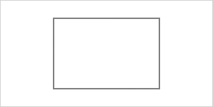
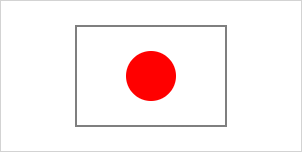

# Extend existing shapes

In **CanvasPainter.js**, shapes can be extended to create custom variants with specialized behaviors or appearances. This allows you to reuse existing shapes and enhance them by adding new features or visual elements. In this section, we'll walk through the process of extending a rectangle to create a new shape called `Japan`, which draws a white rectangle with a red circle in the middle, resembling the japanese flag.

## Extend the existing shape

To create the `Japan` shape, we can extend the existing `Rectangle` shape. The `Japan` shape will reuse the rectangle's structure and style, while adding extra drawing instructions to render the circle in the middle of the rectangle.

```js
import { Rectangle } from '@avolutions/canvas-painter';

class Japan extends Rectangle {

}
```

This way, `Japan` has the same properties and methods as `Rectangle`.

## Override definition and style

We want `Japan` to have a static size and no rotation. Also, background should always be white with a black border. Therefore we will override the constructor and only provide the wanted values as parameters.

```js
class Japan extends Rectangle {
  constructor(x, y) {
    const style = {
      color: 'white',
      border: {
        color: 'black',
        width: 1
      }
    }

    super(x, y, 150, 100, 0, style);
  }
}

const japan = new Japan(75, 25);
```

This way, we create a shape at the wanted position, but always with the same size (150x100), without rotation and with a black border.



## Extend rendering

Currently `Japan` is using the `render()` method of `Rectangle`. But of course we want to extend this to additionally render a red circle in the middle of the rectangle.

To do so, we just can override the `render()` method in `Japan` class, call the base `render()` method of `Rectangle` and then render our own stuff.

```js
class Japan extends Rectangle {
  render(context) {
    super.render(context); // Call render method of Rectangle

    // Draw a red circle in the center of the rectangle
    const center = new Point(
      this.position.x + this.width / 2,
      this.position.y + this.height / 2,
    );

    const circle = new Circle(center, 25, { color: 'red' });
    circle.render(context);
  }
}
```

This will result in the following output:

