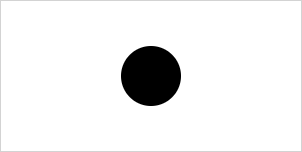

# Circle

The `Circle` shape in **CanvasPainter.js** represents a perfect circle on the canvas, defined by its center point and radius. Circles are fundamental geometric shapes that can be used in a wide variety of graphical applications, from simple icons to complex visualizations. In **CanvasPainter.js**, the `Circle` shape offers flexibility in how it is defined and rendered, allowing you to easily customize its position, size, and appearance.

## Usage

A new circle shape is created using one of the `Circle` constructors.

```js
import { Circle } from '@avolutions/canvas-painter';

const circle = new Circle(
  center,   // A Point representing the center position of the circle
  radius,   // The radius of the circle
  style,    // (optional) Style properties for this circle.
);
```

```js
import { Circle } from '@avolutions/canvas-painter';

const circle = new Circle(
  centerX,  // The X-coordinate of the center point.
  centerY,  // The Y-coordinate of the center point.
  radius,   // The radius of the circle
  style,    // (optional) Style properties for this circle.
);
```

The detailed API documentation for `Circle` can be found [here](../../api/classes/Circle).

## Draw a circle using a point

To draw a basic circle you just need to provide a center and a radius.

```js
import { Canvas, Circle, Point } from '@avolutions/canvas-painter';

const canvas = Canvas.init('myCanvas');

// Define the center of the circle
const center = new Point(150, 75);

// Create the circle with
const circle = new Circle(center, 30); // center, radius

canvas.draw(circle);
```

**Rendered Output:**



In this example we draw a circle with center position at 150, 75 and a radius of 30 using the default style (color = black, no border).

## Draw a circle using individual coordinates

You can also specify a circle by providing individual coordinates (`x` and `y`) for the center position.

```js
import { Canvas, Circle, Point } from '@avolutions/canvas-painter';

const canvas = Canvas.init('myCanvas');

// Create the same circle using coordinates
const circle = new Circle(150, 75, 30) // center.x, center.y, radius

canvas.draw(circle);
```

**Rendered Output:**


This example will give you the exact same output as the example where we use a point as center.

## Modify a circle

In this chapter, you'll learn how to update a circle's properties such as its `center`, `radius` and `style` using the setters provided by **CanvasPainter**. Additionally, you'll explore how to use methods like `move()` and `resize()` to dynamically update the circle's attributes.

There are two different ways to modify the circle definition:
1. Set the properties directly to a new value
2. Using helper methods to modify the properties by a given delta

### Available properties

Property | Description | Example
--- | --- | ---
`center` | Sets the center position of the circle. | `circle.center = new Point(5, 10);`<br />`circle.center.x = 5;`
`radius` | Sets the radius of the circle. Needs to be a positive number. | `circle.radius = 10;`
`style` | Sets the style attributes of the circle. | `circle.style = { color: "red" };`<br />`circle.style.color = "red";`

### Available methods

Method | Description | Example
--- | --- | ---
`move()` | Moves the center of the circle by adjusting the current center by delta values. | `circle.move(5, -10);`
`resize()` | Resizes the circle by adjusting the current radius by delta values. | `circle.resize(7.5);`

## Get properties of a circle

In addition to manipulating a circle's properties, **CanvasPainter** allows you to retrieve the current values of its attributes such as `center`, `radius` and `style`.

```js
import { Canvas, Circle } from '@avolutions/canvas-painter';

const canvas = Canvas.init('myCanvas');

// x, y, width, height
const circle = new Circle(150, 100, 50);

const center = circle.center; // Get current center as Point(150, 100)
```

### Available properties

Property | Description | Example
--- | --- | ---
`center` | Gets an [Point](../../api/classes/Point) object representing the center position of the circle. | `const center = circle.center;`<br />`const x = center.x;`
`radius` | Gets the current radius of the circle. | `const radius = circle.radius;`
`style` | Gets a [CircleStyle](../../api/classes/CircleStyle) object representing the style of the circle. | `const style = circle.style;`<br />`const color = circle.style.color;`

## Serialize a circle

The `Circle` shape in **CanvasPainter.js** can be serialized into both array and JSON formats using the `toArray()` and `toJson()` methods. These methods allow you to easily convert the circle's definition into standard formats for saving, exporting, or transmitting data.

### Serialize to array

The `toArray` method converts the circle's definition into an array. This can be useful when you need a lightweight representation of the point, or when you need to work with libraries or functions that expect data in array format.

```js
const circle = new Circle(10, 10, 20);
circle.toArray();
```

This will give you an array in this format:

```js
[
  [x, y], // center
  radius  // radius
]
```

### Serialize to JSON

The `toJson()` method for a circle returns a structured JSON string that includes the circles definition. This format is ideal for working with APIs or saving to structured data formats.

```js
const circle = new Circle(10, 10, 20);
circle.toJson();
```

This will give you a JSON string in this format:

```js
{
  center: {
    x: number,
    y: number
  },
  radius: number
}
```

## Style

The following table is showing all available circle styles and the default values if no value was provided explicit.

Style | Default | Explanation
--- | --- | ---
`color` | '#000000' (black) | Sets the default fill color for the circle.
`border.color` | '#000000' (black) | Defines the color of circle border. Border is only shown if `border.color` or `border.width` is provided.
`border.width` | 1.0 | Defines the width of circles border. Border is only shown if `border.color` or `border.width` is provided.
