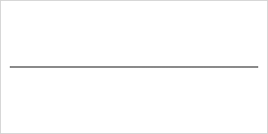

# Line

The `Line` shape in **CanvasPainter.js** allows you to create and render straight lines on a canvas. It is flexible in terms of how you can define it — either by passing `Point` objects for the start and end positions or by specifying the individual coordinates directly. The line can also be styled using the `LineStyle`, allowing you to control its appearance on the canvas.

## Usage

A new line shape is created using one of the `Line` constructors.

```js
import { Line } from '@avolutions/canvas-painter';

const line = new Line(
  start,    // A Point representing the start position of the line
  end,      // A Point representing the end position of the line
  style,    // (optional) Style properties for this line.
  options   // (optional) Options for this line.
);
```

```js
import { Line } from '@avolutions/canvas-painter';

const line = new Line(
  startX,   // The X-coordinate of the starting point.
  startY,   // The Y-coordinate of the starting point.
  endX,     // The X-coordinate of the ending point.
  endY,     // The Y-coordinate of the ending point.
  style,    // (optional) Style properties for this line.
  options   // (optional) Options for this line.
);
```

The detailed API documentation for `Line` can be found [here](../../api/classes/Line).

## Draw a line using points

To draw a basic line you just need to provide a start and an end point.

```js
import { Canvas, Line, Point } from '@avolutions/canvas-painter';

const canvas = Canvas.init('myCanvas');

// Define the start and end points of the line
const startPoint = new Point(10, 75);
const endPoint = new Point(290, 75);

// Create the line
const line = new Line(startPoint, endPoint);

canvas.draw(line);
```

**Rendered Output:**



In this example we draw a line from start (75, 10) to end (75, 290) using the default style (width = 1, color = black).

## Draw a line using individual coordinates

You can also specify a line by providing individual coordinates (`x` and `y`) for both the start and end positions.

```js
import { Canvas, Line, Point } from '@avolutions/canvas-painter';

const canvas = Canvas.init('myCanvas');

// Create the same line using coordinates
const line = new Line(75, 10, 75, 290) // start.x, start.y, end.x, end.y

canvas.draw(line);
```

**Rendered Output:**


This example will give you the exact same output as the example where we use points as start and end.

## Modify a line

In this chapter, you'll learn how to update a line's properties such as its `start`, `end` and `style` using the setters provided by **CanvasPainter**. Additionally, you'll explore how to use methods like `moveStart()` and `moveEnd()` to dynamically update the line's attributes.

There are two different ways to modify the line definition:
1. Set the properties directly to a new value
2. Using helper methods to modify the properties by a given delta

### Available properties

Property | Description | Example
--- | --- | ---
`start` | Sets the start position of the line. | `line.start = new Point(5, 10);`<br />`line.start.x = 5;`
`end` | Sets the end position of the line. | `line.end = new Point(5, 10);`<br />`line.end.x = 5;`
`style` | Sets the style attributes of the line. | `line.style = { color: "red" };`<br />`line.style.color = "red";`

### Available methods

Method | Description | Example
--- | --- | ---
`moveStart()` | Moves the line start by adjusting the current position by delta values. | `line.moveStart(5, -10);`
`moveEnd()` | Moves the line end by adjusting the current position by delta values. | `line.moveEnd(-2, 7.5);`
`move()` | Moves the line start & end by adjusting the current position by delta values. | `line.move(-4.2, 8.15);`

## Get properties of a line

In addition to manipulating a line's properties, **CanvasPainter** allows you to retrieve the current values of its attributes such as `start`, `end` and `style`.

```js
import { Canvas, Line } from '@avolutions/canvas-painter';

const canvas = Canvas.init('myCanvas');

// x, y, width, height
const line = new Line(150, 100, 100, 50);

const start = line.start; // Get current start as Point(150, 100)
```

### Available properties

Property | Description | Example
--- | --- | ---
`start` | Gets an [Point](../../api/classes/Point) object representing the start position of the line. | `const start = line.start;`<br />`const x = start.x;`
`end` | Gets an [Point](../../api/classes/Point) object representing the end position of the line. | `const end = line.end;`<br />`const x = end.x;`
`style` | Gets a [LineStyle](../../api/classes/LineStyle) object representing the style of the line. | `const style = line.style;`<br />`const color = line.style.color;`

## Serialize a line

The `Line` shape in **CanvasPainter.js** can be serialized into both array and JSON formats using the `toArray()` and `toJson()` methods. These methods allow you to easily convert the line's definition into standard formats for saving, exporting, or transmitting data.

### Serialize to array

The `toArray` method converts the line's definition into an array. This can be useful when you need a lightweight representation of the point, or when you need to work with libraries or functions that expect data in array format.

```js
const line = new Line(10, 10, 20, 20);
line.toArray();
```

This will give you an array in this format:

```js
[
  [x, y], // start
  [x, y]  // end
]
```

### Serialize to JSON

The `toJson()` method for a line returns a structured JSON string that includes the lines definition. This format is ideal for working with APIs or saving to structured data formats.

```js
const line = new Line(10, 10, 20, 20);
line.toJson();
```

This will give you a JSON string in this format:

```js
{
  start: {
    x: number,
    y: number
  },
  end: {
    x: number,
    y: number
  }
}
```

## Style

The following table is showing all available line styles and the default values if no value was provided explicit.

Style | Type | Default | Explanation
--- | --- | --- | ---
`color` | string | '#000000' (black) | Sets the color for the line.
`cursor` | [Cursor](../../api/enumerations/Cursor) | [Cursor.Default](../../api/enumerations/Cursor#default) | Specifies a custom cursor style for the shape. Overrides the default cursor when interacting with the shape.
`width` | number | 1.0 | Defines the width of the line.

You can specify styles for different shape states by providing a unique set of properties under each state (e.g., hover, selected, active). Each state-specific style overrides the default only while the shape is in that state.

```js
{
  color: '#00000',
  cursor: Cursor.Default,
  width: 1.0,
  hover: {
    color: '#00000',
    cursor: Cursor.Default,
    width: 1.0
  }
}
```

## Options

The following table is showing all available line options and the default values if no value was provided explicit.

Option | Type | Default | Explanation
--- | --- | --- | ---
`visible` | boolean | true | If `true`, the line will be visible.<br />If `false` or `undefined`, the line will be hidden.

```js
{
  visible: true
}
```